# hdc2021-psfnn

Deblur images of the HDC2021 dataset.

* [Challenge Website: https://www.fips.fi/HDCdata.php#anchor1](https://www.fips.fi/HDCdata.php#anchor1)
* [HDC2021 Dataset: https://zenodo.org/record/4916176](https://zenodo.org/record/4916176)
* [DIV2k Dataset: https://data.vision.ee.ethz.ch/cvl/DIV2K/](https://data.vision.ee.ethz.ch/cvl/DIV2K/)

# Algorithm

For each stage/step:

1. Estimate a coordinate transformation matrix to dewarp the blurry images so they match the sharp images better
2. Estimate a point spread function and an offset to minimize the mean squared error between the convolved sharp image plus offset and the dewarped blurry images. Use regularization to prevent PSF from blowing up.
3. Blur a bunch of natural images from DIV2K dataset with estimated PSF.
4. Jointly train a neural network to deblur images from both the DIV2K dataset and the HDC2021 dataset.

# Installation instructions

Currently, the test code requires a GPU with lots of VRAM (we used an NVIDIA A100 GPU with 40 GB VRAM).

To install PyTorch, visit https://pytorch.org/ and follow the installation instructions.

After that, running `pip install pillow numpy opencv-python` is probably sufficient for testing.

The following combinations of libraries have been testet to work. Others might work as well.

Debian 10:

```
torch==1.8.1+cu111
opencv-python==4.4.0.42
Pillow==8.2.0
numpy==1.20.1
```

Windows 10:

```
torch==1.9.0+cu111
opencv-contrib-python==4.5.2.54
Pillow==8.2.0
numpy==1.20.3
```

# Usage

```
python3 main.py path/to/input/files path/to/output/files 3
```

where `3` is the stage/step of the HDC2021 dataset.

Alternatively, place the HDC2021 directories at `~/data/hdc2021/step1/` etc., adjust `step` and `font` in `main.py` and then run without arguments.

This will download the appropriate neural network and apply it to all images in the input directory to produce images in the output directory.

After that, change to the `test` directory, modify `step` and `font` in `compute_ocr_score.py` and then run it.

# OCR Scores

|Step|Verdana|Times|
|---|---|---|
|0|97.82|94.46|
|1|97.01|95.23|
|2|97.36|94.78|
|3|97.07|95.89|
|4|97.15|96.53|
|5|98.36|95.47|
|6|96.65|94.61|
|7|96.04|93.95|
|8|92.15|87.68|
|9|83.63|70.54|
|10|77.66|72.71|

Notes:
* The input images are simply used as-is for step 1, 2 and 3 without any deblurring since that passes the 70% OCR threshold of the challenge without wasting a few hours of additional compute.
* Most hyperparameters are not optimized. It is very likely that more stages could be passed by training a neural network on larger image crops.

# Citations

The neural network used here is adapted (almost entirely copied) from [https://github.com/MarcoForte/FBA_Matting](F, B, Alpha Matting)

```
@article{forte2020fbamatting,
  title   = {F, B, Alpha Matting},
  author  = {Marco Forte and François Pitié},
  journal = {CoRR},
  volume  = {abs/2003.07711},
  year    = {2020},
}
```

NTIRE 2017 Challenge on Single Image Super-Resolution: Dataset and Study

* https://people.ee.ethz.ch/~timofter/publications/Agustsson-CVPRW-2017.pdf
* https://data.vision.ee.ethz.ch/cvl/DIV2K/

```
@InProceedings{Agustsson_2017_CVPR_Workshops,
    author = {Agustsson, Eirikur and Timofte, Radu},
    title = {NTIRE 2017 Challenge on Single Image Super-Resolution: Dataset and Study},
    booktitle = {The IEEE Conference on Computer Vision and Pattern Recognition (CVPR) Workshops},
    month = {July},
    year = {2017}
}
```

# Authors

* Thomas Germer
* Tobias Uelwer
* Stefan Harmeling

(All affiliated with Heinrich Heine University Düsseldorf)

# Images

The point spread function estimate for step 4 is shown below. With a bit of imagination, the aperture shape of the Canon EF 100mm f/2.8 USM Macro lens can be seen.


A sharp input image, blurry target image, convolved sharp image + offset and the difference between the last two multiplied by 10 is shown below. The error is larger on the top right of the image, which suggests that a spatially varying PSF could improve results further.


# Example Images (Times)

| Step |         Original                    |         Deblurred                    |
|:----:|:-----------------------------------:|:------------------------------------:|
| 0 ||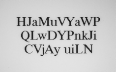|
| 1 ||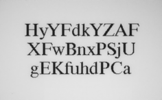|
| 2 ||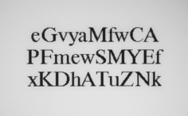|
| 3 |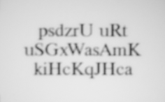|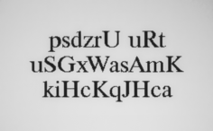|
| 4 |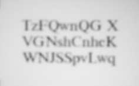|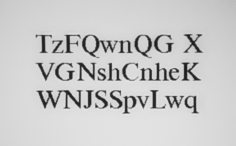|
| 5 |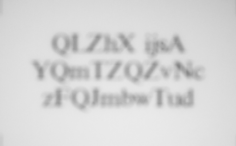||
| 6 ||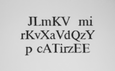|
| 7 |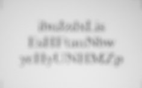|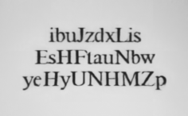|
| 8 |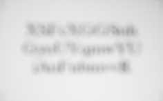||
| 9 |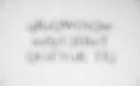|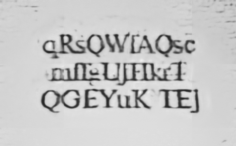|
| 10|||

* example images
* remove GPU dependency
* remove OpenCV dependency
